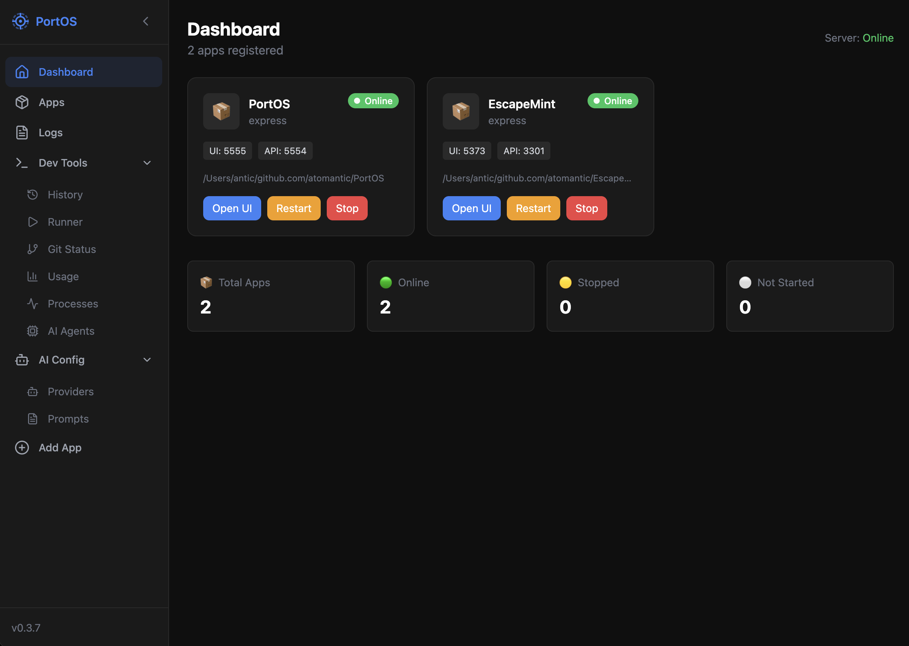
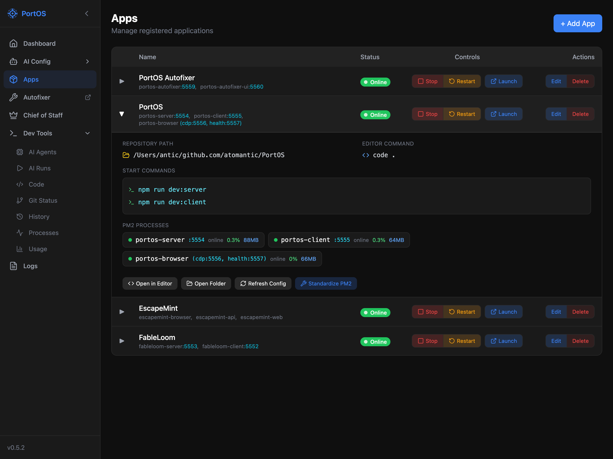
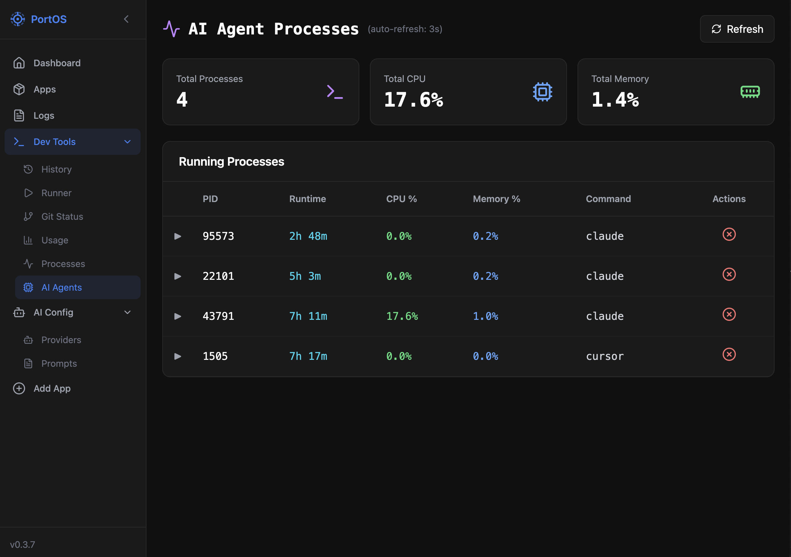
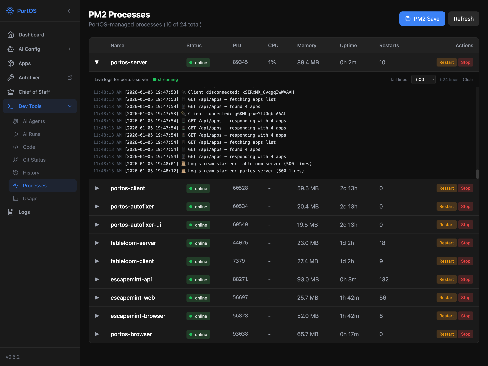
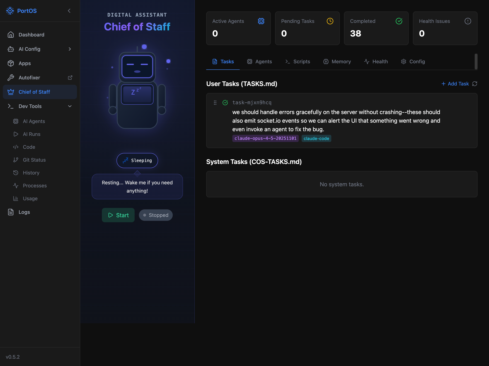
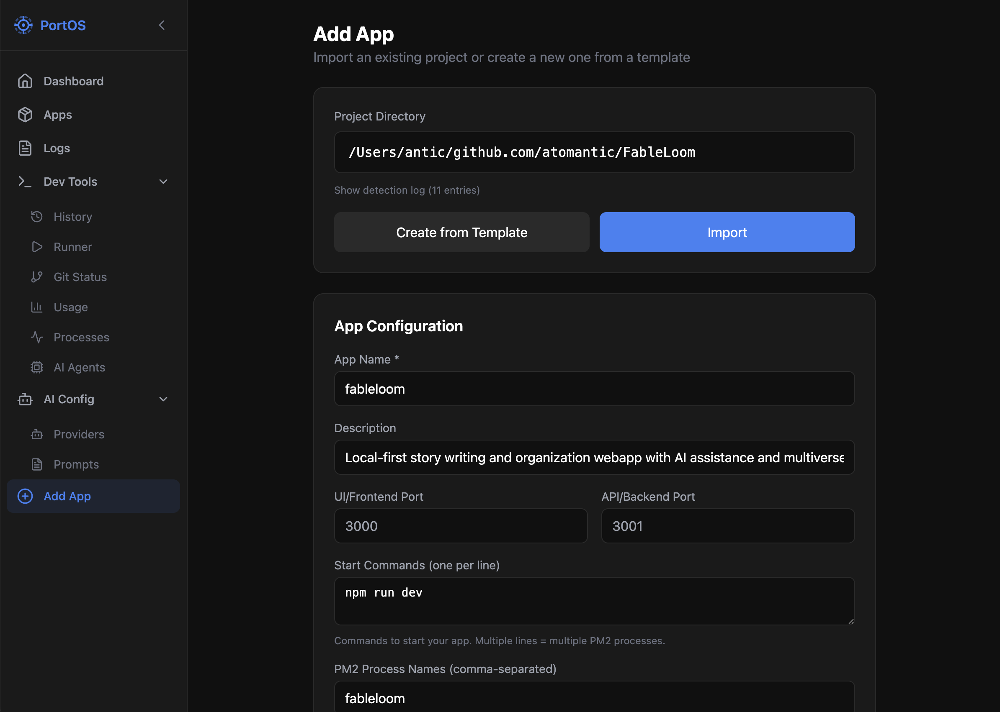

# PortOS

A self-hosted App OS portal for your dev machine. Manage all your local development apps from a single dashboard — accessible from anywhere via [Tailscale](https://tailscale.com).

Think Umbrel, but for your active git repos and dev environments. Access your dev apps from your phone, tablet, or any device on your Tailscale network.



## Features

- **App Dashboard** — Grid of app tiles with status indicators, port links, and quick actions
- **Start/Stop/Restart** — Control your apps directly from the dashboard or apps table
- **Real-time Logs** — Stream PM2 logs via Socket.IO with tail length control
- **Smart Import** — Point to a directory and auto-detect project config from package.json, vite.config, and ecosystem.config
- **Chief of Staff** — Autonomous task manager that monitors TASKS.md and dispatches AI agents
- **Dev Tools** — Process monitor, AI agent tracker, action history, git status, and shell runner
- **AI Runner** — Execute prompts via Claude Code, Codex, Gemini CLI, Ollama, or LM Studio
- **Mobile Ready** — Responsive design with collapsible sidebar for on-the-go access

## Screenshots

### Apps Management
Expandable app rows with start/stop controls, PM2 process status, ports, and quick actions.



### AI Agent Processes
Monitor running AI agents (Claude, Cursor, etc.) with runtime, CPU, and memory stats.



### PM2 Processes
View all PM2 processes with live log streaming, memory usage, uptime, and restart controls.



### Chief of Staff
Autonomous task manager that monitors your TASKS.md and dispatches AI agents to complete work.



### App Import
Auto-detect project configuration from your codebase — ports, start commands, and PM2 process names.



## Quick Start

```bash
git clone https://github.com/atomantic/PortOS.git
cd PortOS
./setup.sh
npm run dev
```

Access PortOS at http://localhost:5555 (or http://[your-machine-name]:5555 via Tailscale)

## Network Access

PortOS binds to `0.0.0.0` so you can access it from any device on your Tailscale network:

- Manage apps running on your home dev machine from anywhere
- Check logs and restart services from your phone
- View dashboard on your tablet while coding on your laptop

> **Security Note**: PortOS is designed for private Tailscale networks. Do not expose ports 5554/5555 to the public internet.

## Project Structure

```
PortOS/
├── client/              # React + Vite frontend (port 5555)
├── server/              # Express.js API (port 5554)
├── data/                # Runtime data (apps, providers, history)
├── data.sample/         # Sample configurations to copy
├── docs/                # Documentation and screenshots
└── ecosystem.config.cjs # PM2 configuration
```

## PM2 Commands

```bash
# Start PortOS
pm2 start ecosystem.config.cjs

# View status
pm2 status

# View logs
pm2 logs portos-server --lines 100
pm2 logs portos-client --lines 100

# Restart both processes
pm2 restart portos-server portos-client

# Stop both processes
pm2 stop portos-server portos-client

# Save process list (survives reboot)
pm2 save
```

## Configuration

### Apps (`data/apps.json`)
Each registered app includes:
- **name** — Display name in the dashboard
- **repoPath** — Absolute path to project directory
- **uiPort / apiPort** — Port numbers for quick access links
- **startCommands** — Commands to start the app (used by PM2)
- **pm2ProcessNames** — PM2 process identifiers for status tracking

### AI Providers (`data/providers.json`)
Configure AI providers for the runner:
- **CLI-based**: Claude Code, Codex, Gemini CLI
- **Local models**: Ollama, LM Studio (OpenAI-compatible endpoints)

## Security

- Command runner uses an allowlist (npm, git, pm2, docker, etc.)
- No shell interpolation — commands use spawn with argument arrays
- Designed for private Tailscale networks only
- No authentication (relies on network-level security)

## Documentation

- [Contributing Guide](./docs/CONTRIBUTING.md) — Development setup and code guidelines
- [Port Allocation](./docs/PORTS.md) — Port conventions and allocation guide
- [Versioning & Releases](./docs/VERSIONING.md) — Version format and release process
- [Implementation Plan](./PLAN.md) — Detailed feature roadmap and API reference

## License

MIT
